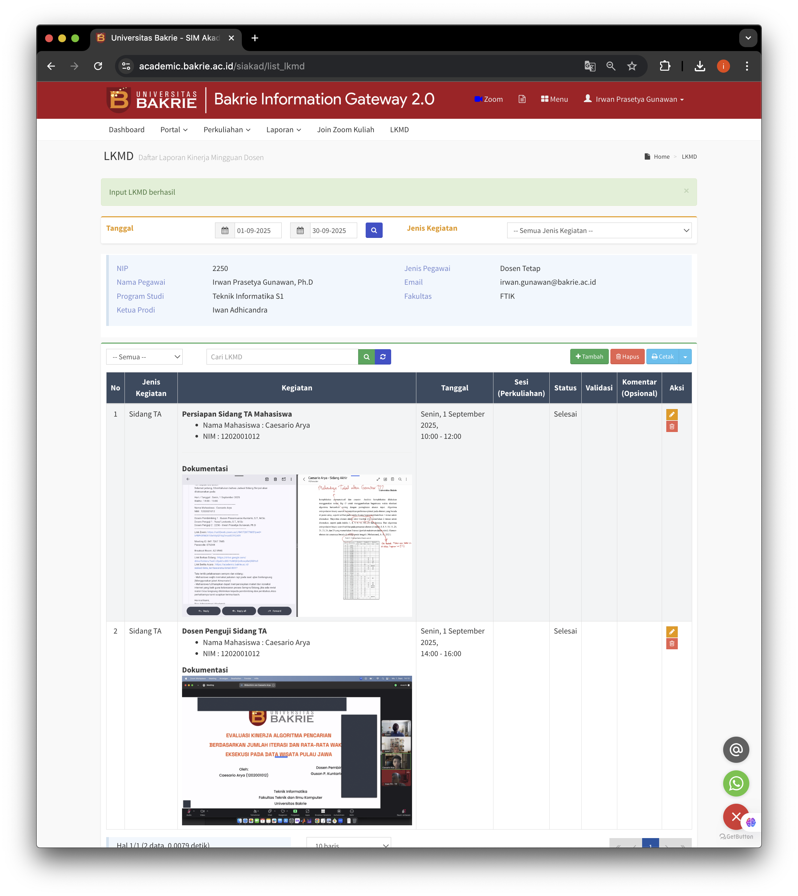
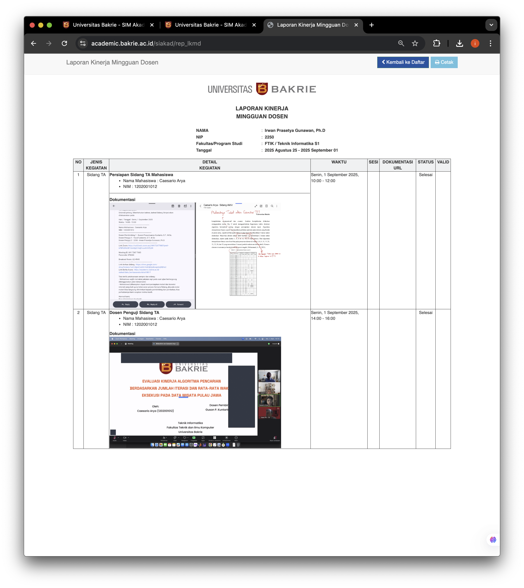

# LKMD BIG 2.0
{: .no_toc .text-delta }

Halaman ini akan menjelaskan ringkasan langkah tahap demi tahap untuk membuat laporan LKMD berbasis web pada BIG 2.0 dengan fitur dokumentasi visual (gambar/screenshot). 

## Daftar Isi
{: .no_toc .text-delta }

* TOC
{:toc}

## Persiapan
  - Mendokumentasikan kegiatan dalam bentuk gambar/foto/screenshoot.
  - Mengupload gambar ke repository file; untuk contoh di sini, kita menggunakan repository file yang ada di [https://files.bakrie.ac.id/](https://files.bakrie.ac.id/)
  - Mengeset share link gambar yang sudah diupload ke repository file; misalnya, pada contoh di bawah ini, link gambar pada repo tersebut ada di [https://files.bakrie.ac.id/s/9kj33C6m5Xd6fYK](https://files.bakrie.ac.id/s/9kj33C6m5Xd6fYK)
    
    
  
## Mengisi Detail Kegiatan
  - Isi dengan teks biasa untuk deskripsi kegiatan
  - Atau, bisa juga gunakan template kode html berikut untuk mengisi judul kegiatan dan rincian sederhana kegiatan:
    ```html
    <b>NAMA KEGIATAN</b>
    <br>
    <ul>
      <li> Deskripsi singkat 1
      <li> Deskripsi singkat 2
      <li> dst
    </ul>
    ```
  - Tambahkan dengan link ke gambar yang sudah diupload di repository file dengan menambahkan baris berikut:
    ```html
    
    ```
    Perhatikan bahwa pada bagian yang menandakan sumber gambar (source/src image) kita isi dengan link pada gambar yang ada di repo di atas + '/preview' agar gambar bisa ditampilkan pada rekap LKMD di BIG.

    * Lokasi URL gambar di repo: `https://files.bakrie.ac.id/s/9kj33C6m5Xd6fYK`
    * Link gambar yang kita masukkan di Detail Kegiatan isian LKMD: `https://files.bakrie.ac.id/s/9kj33C6m5Xd6fYK/preview`

  - Untuk file gambar yang diupload ke folder repository lain seperti github, misalnya, URL gambar yang diupload adalah sebagai berikut:
     ```html
     
     ```

## Menyimpan
  - Jangan lupa untuk selalu melakukan saving setiap kali melakukan perubahan detail isian LKMD.
  - Perhatikan selalu kategori kegiatan agar tepat dengan pekerjaan yang dilakukan.
  - Jangan lupa juga untuk mengisi isi-isian waktu mulai dan akhir.
  - Jangan lupa mengeklik tombol simpan data.

## Contoh Tampilan 

  - Menu LKMD

  

  - Print out (jika dibutuhkan)
    
  
    
## Template

Template isian item laporan LKMD berbasis web/html agar bisa menggunakan font styles, list, dan gambar:

```html
<b>NAMA KEGIATAN</b>
<br>
<ul>
  <li> Deskripsi singkat 1
  <li> Deskripsi singkat 2
  <li> dst
</ul>
<br>
<b>Dokumentasi
<br>
<ol>
<li>Upload repo UBakrie:<br>

<li>Upload repo lain (Github): <br>

</ol>
```